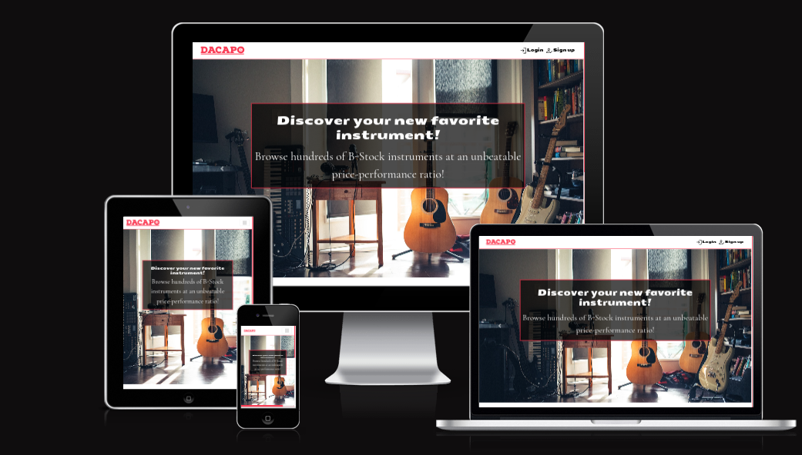
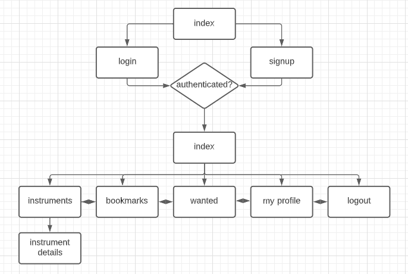
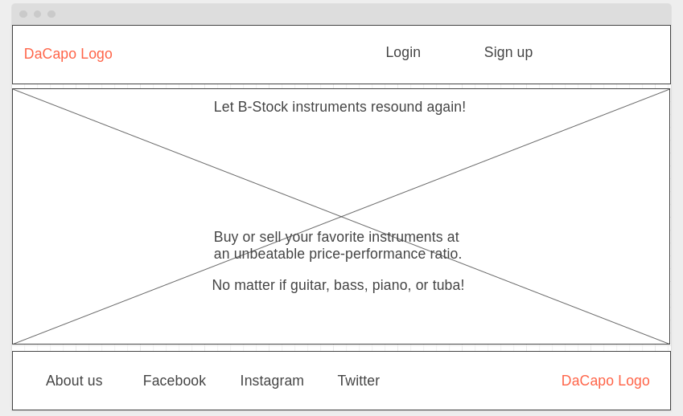
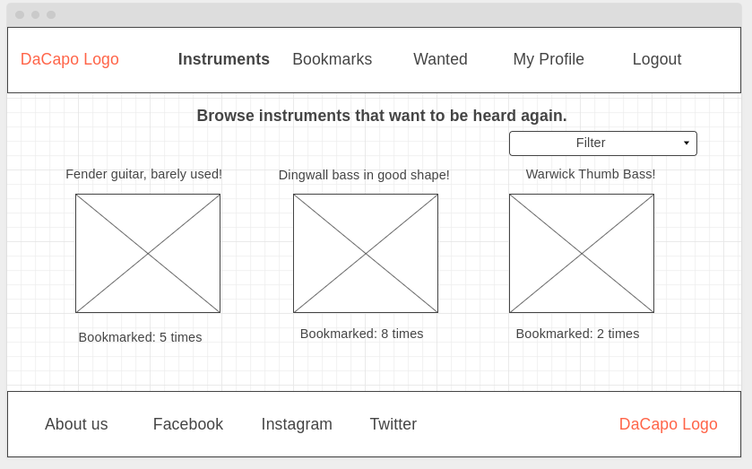
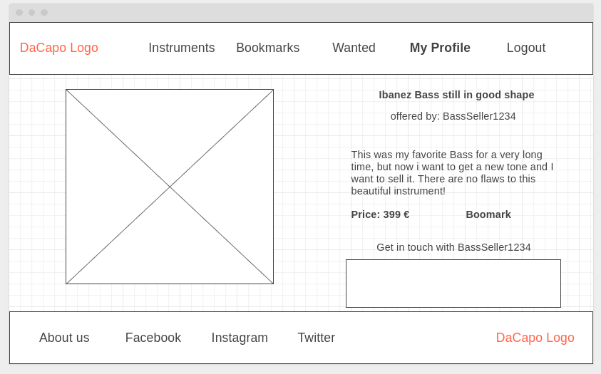
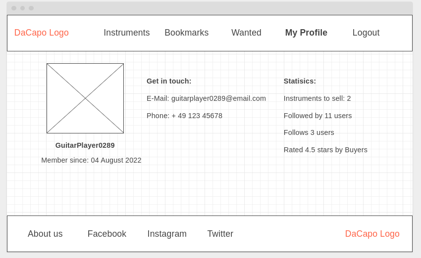
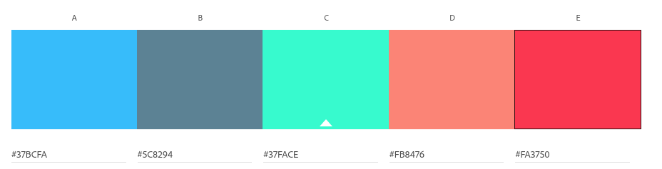
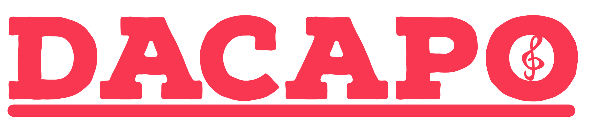
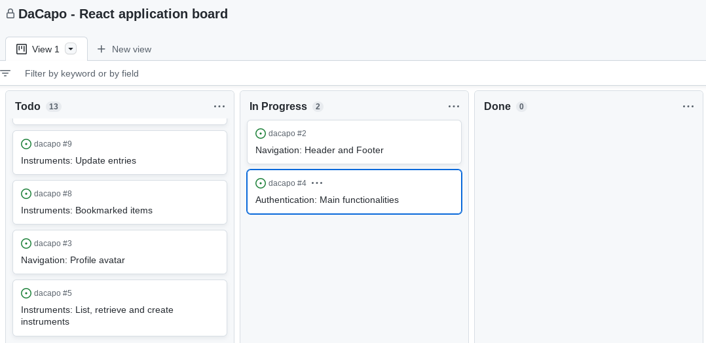
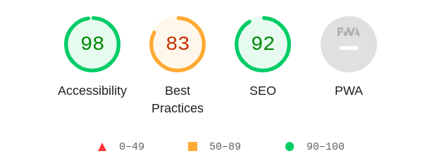

# DaCapo
## Let B-stock instruments resound again!

[Click here for the full website access](https://dacapo.herokuapp.com/)

## Backend project of DaCapo
[Click here for the according API project](https://github.com/thomasstrassmann/DaCapo-API)

## Table of contents
1. [Introduction](#introduction) 
2. [Preparation](#preparation)
3. [Development](#development)
4. [Features](#features)
5. [Testing](#testing)
6. [Deployment](#deployment) 
7. [Notes](#notes) 
8. [Credits / attributes](#credits) 

## Introduction 

Welcome to DaCapo documentation, the web application for used musical instruments. On the platform, users have the opportunity to offer their musical instruments for sale, or in return to contact sellers of other instruments themselves. 

The aim of the platform is to bring buyers and sellers together in a targeted manner and to make B-stock instruments resound again. Hence the name: DaCapo. 
It is an Italian term from music theory and means something like "start from the beginning" or "encore". In this context, the instruments start from the beginning with a new owner. 

As an introduction, it should be mentioned here that this repository represents only a part of the project, namely the frontend, implemented with React. The link to the backend can be found above under the heading. 

Before we get into the application itself, we will take a short look at the frontend development itself. What do frontend developers do? Why are they important and what are they responsible for?

The role of the frontend developer is a very complex one these days. He is mainly responsible for what the user sees, i.e. the user interface. This includes the style, layout and design of websites or applications and the user experience generated by them. This includes completely new projects that need to be created as well as older projects that need to be optimized. The latter involves optimizations on both sides: On the one hand optimization of the code (clean, reusable code), on the other hand optimization of the user experience (navigation, structure, loading times etc.).

The focus is not only on the company's own data, but also with the use of APIs, data from external sources can be queried and displayed in order to show the most diverse content possible. 

In short, they are responsible for using frontend technologies (HTML, CSS, JavaScript, frameworks and libraries such as React) to develop the most attractive and engaging websites and applications possible - because applications are only as good as long as visitors stay on them and are willing to come back. 

## Preparation

In preparation for this project, not only the usual user experience design is used, but also generally formulated project goals, which are brought together directly with the user stories in the kanban board. 

In the following, the project goals (bold statements) are listed with the corresponding user stories (bullet points): 

**The project should provide a platform for users to upload their instruments and offer them for sale.**

* As a user I can list and create instruments, as well as bookmark them, so that I can buy and keep track of my favorite instruments.
* As a user I want the ability to contact the seller on the instruments detail view, so that I can purchase the item quickly, or get extra information about it.
* As an item owner I can update any instruments, so that I can correct mistakes, make the instruments more attractive and keep them up to date.
* As a user I want to be able to view and edit my wanted items, so that I can attract attention, when a desired instrument is not in the database.

**The project should offer a comfortable and intuitive interface to interested parties, so that the search is as targeted as possible.**

* As a user, I can see my status in the navigation bar, so that I can decide If I want to sign in / register or logout.
* As a user, I can use the header and footer on every page, so that I can navigate quickly and easily.
* As a user I can search and filter the instrument section, as well as experience an infinite scroll, so that I can find the results I want even better and faster.
* As a user I can look at my bookmarked items, so that I can take actions on them quickly without searching them again.
* As a user I can take a look at my feeds (bookmarked and followed), so that I have an overview of my favorite instruments and sellers.

**The project should establish / initiate communication between buyers and sellers and encourage exchange.**

* As a user I can see the avatar of the profiles, so that I can personalize my own account and relate to other users, improving the UX.
* As a user I can see my own and other profiles, so that I know who the seller is, view their instruments and activity.
* As a user I want to rate sellers so that I can voice my opinion on a shopping experience and get more intel as to how credible a seller is.

**The project should give the user control over their own account and allow basic settings.** 
* As a user I can change my credentials, so that I can improve my security and update my username.
* As a user I can register, sign in and logout, so that I can be a part of the DaCapo community and maintain my online status.
* As a user I can edit my own profile, so that I can keep my details up to date.

All user stories are must-haves for this project, as this is the minimum standard.

The **UXD - User Experience Design** includes the 5 panels *strategy, scope, structure, skeleton and surface*. 

### Strategy 
What makes DaCapo special? 

The application is basically like ebay, only specialized in musical instruments. 
DaCapo should present the user with an almost infinite range of musical instruments and still be able to quickly and conveniently find the desired items (either by text search, or by a filter). 

So, in short, the USP is: find the instrument you want, in good condition, at a low price, as fast as you can. And maybe find other items that might also be exciting for you, that you haven't thought of before.

---
### Scope 

What can not be implemented within the project, just because of lack of time? 
* An internal message service (messages will be sent via mail)
* A direct payment option (seller and buyer must coordinate the transaction themselves)

The scope, in terms of content, will stretch over 16 Routes (and one 404 page):
* Home
* Login
* Signup
* Instruments (list page)
* Instruments (create / add page)
* Instruments (edit page)
* Instrument (detail page)
* Bookmarks (list page)
* Wanted (list page)
* Wanted (create / add page)
* Wanted (edit page)
* Wanted (detail page)
* Profile (detail page)
* Profile (edit username page)
* Profile (edit credentials page)
* Profile (edit profile page)

To what extent which page contributes to the fulfillment of the user stories can be seen in the sprint board. Here, all user stories are linked to the pages by means of labels. 

There are also a lot of components involved in fulfilling the user stories: 
* Asset
* Avatar
* BackButton
* TopButton
* Contact
* EditDropdown
* NavBar
* NotFound
* Star 

To what extent which component contributes to the fulfillment of the user stories can be seen in the sprint board. Here, all user stories are linked to the component by means of labels. 

Here, further pages and components are omitted too due to time constraints. 
How the individual pages are composed is outlined in the structure section next.

--- 
### Structure 

The structure of the app is kept very simple and is illustrated here, resulting in a simple, clear and intuitive navigation. Due to the time constraints, the navigation levels are not deep, but this also leads to a clear navigation. If the project is continued, more levels could of course be added.  

---
### Skeleton 

In order to implement the pages safer, faster and more efficiently, wireframe models were created in advance. Excluded from this are the pages login, signup and logout, as these are simple pages with either a form element or a feedback display. Wireframe models for Bookmarks and Wanted were left out because they are very similar in structure to Instruments and only differ somewhat in content. Due to the reusable components in React, it is not necessary to make a wireframe of every page anyway. 

However, the Index, Instruments, Instrument Detail and Profile pages use fundamentally different components, which is why wireframes are more worthwhile here. 

At this point it should be mentioned that the wireframes can deviate from the final product sometimes slightly, sometimes strongly, since not all things are predictable. 

---
### Surface

In terms of visual language, the main points that remain are colors, logo and fonts.
The color palette consists of the main color #FA3750 (a slightly pale red on the outside of the spectrum) and some according compound colors. Down below you can see an abstract of the Adobe Color Wheel.

The app logo was created with the Adobe Express. The slightly playful, yet present font with a built-in clef is intended to bridge the gap between a relaxed appearance and a strong brand.

Google Fonts was used for the typography. The font "Seymour One" is used for headlines, titles and important textareas, the font "Cormorant Garamond" is used for everything else (sub-text). The icons in the app are also from Google (Google Icons), but downloaded, not delivered via CDN.

## Development

The entire project was developed in an agile manner. Particularly noteworthy is the sprint board (git hub project), on which the user stories and their status were recorded. For better traceability, the project was set to public. 

Down below, you can see the sprint board in action during development.

## Features
The DaCapo app has many features, which will now be examined in more detail below. 

UX design and accessibility guidelines, and the site is fully responsive.

Another feature are the present and working CRUD operations that the user can perform in the frontend.
These include: 

* the creation

Users also get feedback on all CRUD operations and database states.
This includes: Feedback...

A special feature is also the sending of emails, 

### Features for the future 
The following features would be ideas for further development...

## Testing 

The page and its functionality was tested manually as well as automatically. For a better overview, these two areas are now treated separately from each other. 

**Manual testing**

Manual testing was done primarily using Chrome DevTools (Lighthouse), application function tests with the console, and the built-in linter in VScode.

Manual testing of the application included the following user interactions, procedures and outcomes:

| Test case                      | Procedure                                        | Outcome   |
| ------------------------------ | ------------------------------------------------ | --------- |
| the user can create an account | click on sign up, fill out the form and data is stored in the backend | passed |
| the user can log in            | click on log in, fill out the form and get access to the content  | passed |
| the user can log out           | click on logout and do not have access to content anymore  | passed |
| the user can upload instruments / wanted items | click on "add button", fill out the form and see the new item in the list view | passed |
| the user can update instruments / wanted items | click on settings and the edit button, fill out the form and control the updated data | passed |
| the user can delete instruments / wanted items | when clicking on settings and delete, the item is gone from the frontend and backend | passed |
| user can search instruments / wanted items by search bar | enter keywords into the searchbar and check the items for the speific keyword | passed |
| infinite scroll when scrolling down | scroll down instruments or wanted page until loader shows and new content gets loaded | passed |
| the user can bookmark instruments and delete bookmarks | click on bookmark instrument / remove bookmark and check the result in the bookmark section | passed |
| the user can create a list of bookmarks | like the test above, but with multiple instruments | passed |
| the user can write directly to sellers and seekers via textarea (via mail) | write a test message into the textarea (instruments or wanted), submit the message and check the inbox ot the item owner | passed |
| the user can subscribe / unsubscribe profiles | when clicking on the follow / unfollow button, the according results is shown in realtime on the dashboard / home page | passed |
| the user can rate other profiles once, not the own profile | click on new, foreign profile and rate. View the feedback in realtime. Come Back to the same foreign profile and the profile is already rated. Go to the own profile and the rating section is not present | passed |
| the user can view all information on his / her and other profile/s | go the the own and foreign profiles and check the content for correctness | passed |
| the own profile can be updated (change username, password, avatar and phone number) | Go to all three editing options and check every change after submitting. Deleting the phone number from the form will delete it from the profile as well | passed |
| the user can access 2 fully functional filter functions on the homepage / dashboard when logged in: top 5 profiles by followers and the profiles he / she follows | the 5 profiles with the highest follower count show up in the first section. A sixth user was created with no followers to confirm, he does not show up in the list at any time. The follow / unfollow actions are reflected in realtime in the second section | passed |
| All user interactions give direct feedback on success via alert function | The following feedbacks were tested: create an account, login, create / delete / edit an instrument, create / delete / edit a wanted item, bookmark, remove bookmark, write message via contact form, rate profile, go on rated profile, edit profile on three edit pages, follow / unfollow profile | passed |
| Unauthorized users have no access to the content | Try to access protected content by changing url | passed |

During manual testing, care was taken that: 
* the console does not output any hints or errors (except for intended / inevitable errors e.g. 401).
* No logic errors occur.
* The data is processed correctly in the backend and the frontend. 

Currently there are no bugs or errors that persist, which stands for a robust code. 

The layout was tested for all devices, which have at least a 300px wide screen. No display errors were detected. If other devices show any, they would have to be improved afterwards. 

To test accessibility and SEO, Lighthouse was used. 

**Automatic testing**

The suite consists of  tests, all of which pass at the time of project release.

## Deployment 

After the Django project and apps were created, the project was deployed directly to Heroku in order to be able to plan ahead and spend less time on it in the end. The individual steps were: 

[You can access the website right here](https://)

## Notes

**Security features**

In the course of the creation attention was paid to security at all times. All sensitive information is stored in environment variables and at no time was the project deployed to Heroku with debug=True. No critical information was made public like this. 

**Front-End libraries**

why chosen?
improved UX?

**Requirements**

## Credits

**Code-related**

At this point I would first like to mention the course content from CodeInstitute.

**Images**

Franki Chamaki - https://unsplash.com/photos/U2azMu57UEY

Dolo Iglesias - https://unsplash.com/de/fotos/z9z6u1rn7sY

John Matychuk - https://unsplash.com/de/fotos/gUK3lA3K7Yo

Wes Hicks - https://unsplash.com/de/fotos/MEL-jJnm7RQ

Adam Rhodes - https://unsplash.com/de/fotos/CNDp7FoHEGo

Simon Weisser - https://unsplash.com/de/fotos/phS37wg8cQg

Wim van 't Einde - https://unsplash.com/de/fotos/m98fT1HAo7Q

Gregory Hayes - https://unsplash.com/de/fotos/JdYPVamcc84

Viktor Forgacs - https://unsplash.com/de/fotos/nuRL2Wveb6w

Dominik Scythe - https://unsplash.com/de/fotos/XV9F-gfmThs

Mahyar Mirghasemi - https://unsplash.com/de/fotos/wmms5pSoWZQ

Stefany Andrade - https://unsplash.com/de/fotos/GbSCAAsU2Fo

Susan Mohr - https://unsplash.com/de/fotos/pMCP8c8_xi4